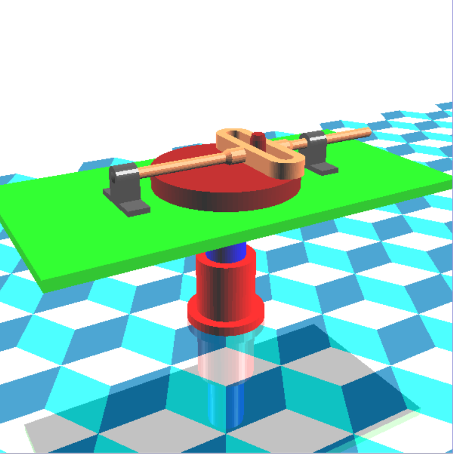

# Mô hình thiết bị cơ khí đơn giản

## Mục tiêu

Bài tập lớn giúp sinh viên làm quen với một số kỹ năng trong đồ họa máy tính như:

- Biết cách mô hình hóa các đối tượng đơn giản
- Tạo các đối tượng phức hợp từ các đối tượng đơn giản
- Thực hành các phép biến đổi trên đối tượng
- Biết cách điều khiển camera
- Tô màu cho đối tượng (Lighting and Shading).
- Tạo hình phản chiếu (Reflection). (Sinh viên tự tìm hiểu tài liệu trên mạng).

## Xây dựng mô hình

 

     
 

Thiết bị gồm các bộ phận tạm gọi như sau: Đế, Xy-lanh, Bàn đỡ, Giá đỡ 1, Giá đỡ 2, Rotor, Thanh trượt, Cơ cấu liên kết, Chốt.

## Tương tác với chương trình

- Phím 1, 2: Điều khiển đế quay xung quanh trục ngược chiều (cùng chiều) kim đồng hồ.
- Phím 3, 4: Điều khiển xy lanh xoay ngược chiều (cùng chiều) kim đồng hồ.
- Phím 5, 6: Điều khiển xy lanh tịnh tiến lên, xuống.
- Phím 7, 8: Điều khiển rotor xoay ngược chiều (cùng chiều) kim đồng hồ.
- Phím A, a: Bật/tắt chế độ hoạt hình (tự động xoay).
- Phím D, d: Bật/tắt nguồn sáng thứ hai. Nguồn sáng thứ nhất luôn luôn bật.
- Phím W, w: Chuyển đổi qua lại giữa chế độ vẽ khung dây và chế độ tô màu.
- Phím Y, y: Khoảng cách camera đến trục Oy tăng/giảm.
- Phím &uparrow;, &downarrow;: Chiều cao camera tăng/giảm.
- Phím &rightarrow;, &leftarrow;: Camera quay cùng chiều/ngược chiều kim đồng hồ.

